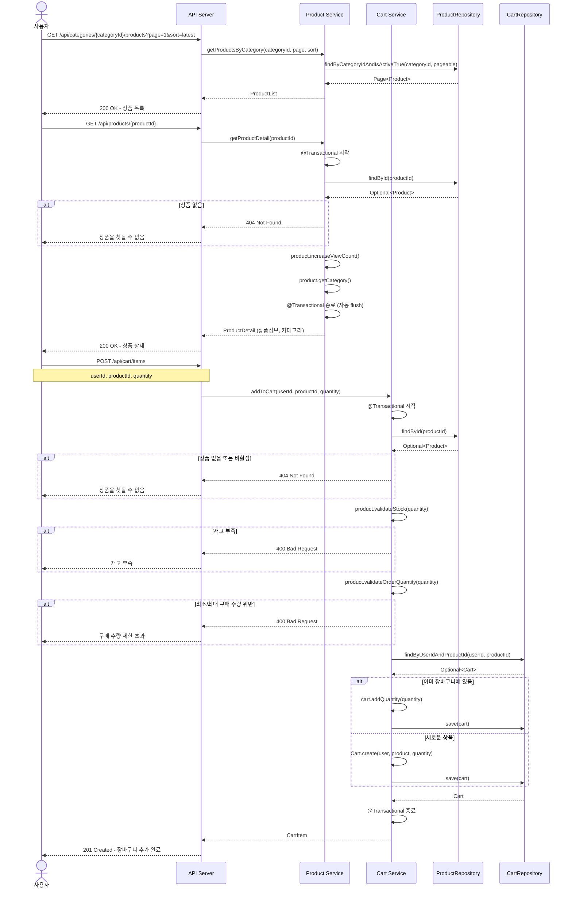
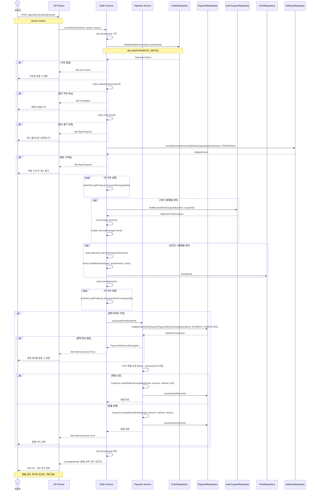
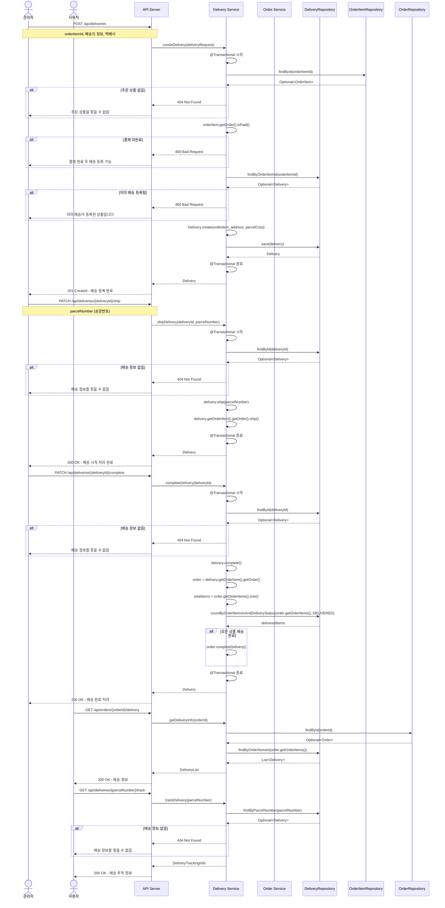
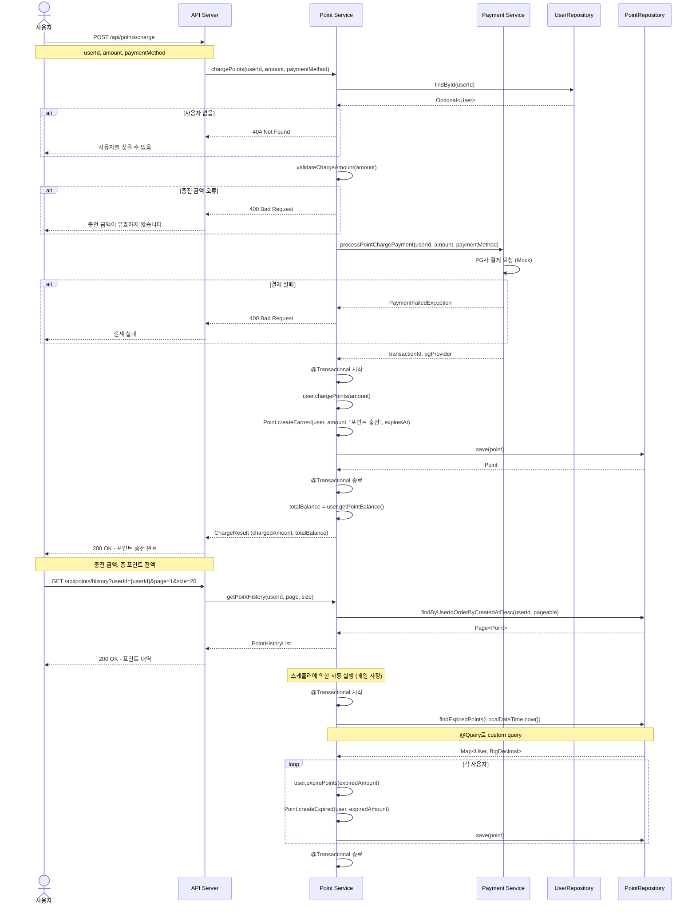
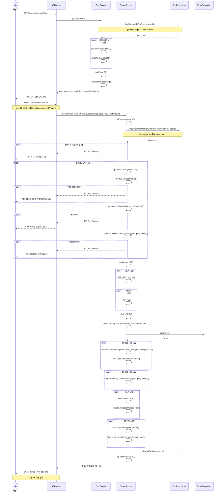

# 시퀀스 다이어그램

## 1. 상품 조회 및 장바구니 추가

---

## 2. 주문 생성 및 결제 프로세스

```mermaid
sequenceDiagram
    actor User as 사용자
    participant API as API Server
    participant OrderService as Order Service
    participant PaymentService as Payment Service
    participant ProductRepo as ProductRepository
    participant UserRepo as UserRepository
    participant UserCouponRepo as UserCouponRepository
    participant OrderRepo as OrderRepository
    participant PaymentRepo as PaymentRepository
    participant PointRepo as PointRepository

    User->>API: POST /api/orders
    Note over User,API: userId, items[{productId, quantity}], couponId, pointAmount

    API->>OrderService: createOrder(orderRequest)

    OrderService->>OrderService: @Transactional 시작

    %% 상품 재고 및 가격 확인 (비관적 락)
    loop 각 주문 상품
        OrderService->>ProductRepo: findByIdWithPessimisticLock(productId)
        Note over OrderService,ProductRepo: @Lock(PESSIMISTIC_WRITE)
        ProductRepo-->>OrderService: Product

        alt 상품 없음 또는 비활성
            OrderService-->>API: 404 Not Found
            API-->>User: 상품을 찾을 수 없음
        end

        OrderService->>OrderService: product.validateStock(quantity)
        alt 재고 부족
            OrderService-->>API: 400 Bad Request
            API-->>User: 재고 부족
        end

        OrderService->>OrderService: product.validateOrderQuantity(quantity)
        alt 수량 제한 위반
            OrderService-->>API: 400 Bad Request
            API-->>User: 구매 수량 제한 초과
        end
    end

    OrderService->>OrderService: 총 금액 계산

    %% 쿠폰 검증 및 할인 계산
    opt 쿠폰 사용
        OrderService->>UserCouponRepo: findByUserIdAndCouponIdAndStatus(userId, couponId, AVAILABLE)
        UserCouponRepo-->>OrderService: Optional<UserCoupon>

        alt 쿠폰 없음 또는 유효하지 않음
            OrderService-->>API: 400 Bad Request
            API-->>User: 사용 불가능한 쿠폰
        end

        OrderService->>OrderService: userCoupon.validate()
        alt 쿠폰 만료
            OrderService-->>API: 400 Bad Request
            API-->>User: 만료된 쿠폰
        end

        OrderService->>OrderService: coupon.validateMinOrderAmount(totalAmount)
        alt 최소 주문 금액 미달
            OrderService-->>API: 400 Bad Request
            API-->>User: 최소 주문 금액 미달
        end

        OrderService->>OrderService: coupon.calculateDiscount(totalAmount)
    end

    %% 포인트 검증
    opt 포인트 사용
        OrderService->>UserRepo: findById(userId)
        UserRepo-->>OrderService: User

        OrderService->>OrderService: user.validatePointBalance(pointAmount)
        alt 포인트 부족
            OrderService-->>API: 400 Bad Request
            API-->>User: 포인트 부족
        end
    end

    %% 최종 금액 계산
    OrderService->>OrderService: 배송비 및 무료배송 확인
    OrderService->>OrderService: 최종 금액 계산 (total - discount + shipping - point)

    %% 주문 생성
    OrderService->>OrderService: Order.create(user, totalAmount, discountAmount, ...)
    OrderService->>OrderRepo: save(order)
    OrderRepo-->>OrderService: Order

    %% 주문 상품 생성 (Cascade)
    loop 각 주문 상품
        OrderService->>OrderService: OrderItem.create(product, quantity, price)
        OrderService->>OrderService: order.addOrderItem(orderItem)
    end

    %% 재고 차감
    loop 각 주문 상품
        OrderService->>OrderService: product.decreaseStock(quantity)
    end

    %% 쿠폰 사용 처리
    opt 쿠폰 사용
        OrderService->>OrderService: userCoupon.use()
        OrderService->>OrderService: coupon.increaseUsageCount()
    end

    %% 포인트 차감
    opt 포인트 사용
        OrderService->>OrderService: user.usePoints(pointAmount)
        OrderService->>OrderService: Point.createUsed(user, pointAmount, order)
        OrderService->>PointRepo: save(point)
    end

    OrderService->>OrderService: @Transactional 종료 (자동 flush & commit)

    OrderService-->>API: Order (PENDING 상태)
    API-->>User: 201 Created - 주문 생성 완료

    %% 결제 처리
    User->>API: POST /api/orders/{orderId}/payment
    Note over User,API: paymentMethod

    API->>PaymentService: processPayment(orderId, paymentMethod)

    PaymentService->>PaymentService: @Transactional 시작

    PaymentService->>OrderRepo: findById(orderId)
    OrderRepo-->>PaymentService: Optional<Order>

    alt 주문 없음
        PaymentService-->>API: 404 Not Found
        API-->>User: 주문을 찾을 수 없음
    end

    %% PG사 결제 요청
    PaymentService->>PaymentService: PG사 결제 요청 (Mock)

    alt 결제 성공
        PaymentService->>PaymentService: Payment.createCompleted(order, amount, method, txId)
        PaymentService->>PaymentRepo: save(payment)

        PaymentService->>PaymentService: order.completePay(paidAt)

        %% 상품 판매량 증가 (Dirty Checking)
        loop 각 주문 상품
            PaymentService->>PaymentService: orderItem.getProduct().increaseSoldCount(quantity)
        end

        PaymentService->>PaymentService: @Transactional 종료

        PaymentService-->>API: Payment 성공
        API-->>User: 200 OK - 결제 완료

    else 결제 실패
        PaymentService->>PaymentService: Payment.createFailed(order, amount, method, reason)
        PaymentService->>PaymentRepo: save(payment)

        %% 롤백 처리
        loop 각 주문 상품
            PaymentService->>PaymentService: orderItem.getProduct().increaseStock(quantity)
        end

        opt 포인트 사용했을 경우
            PaymentService->>PaymentService: order.getUser().refundPoints(pointAmount)
            PaymentService->>PointRepo: deleteByOrderId(orderId)
        end

        opt 쿠폰 사용했을 경우
            PaymentService->>UserCouponRepo: findByUserIdAndCouponId(userId, couponId)
            PaymentService->>PaymentService: userCoupon.restore()
            PaymentService->>PaymentService: coupon.decreaseUsageCount()
        end

        PaymentService->>PaymentService: order.fail()

        PaymentService->>PaymentService: @Transactional 종료

        PaymentService-->>API: Payment 실패
        API-->>User: 400 Bad Request - 결제 실패
    end
```

---

## 3. 선착순 쿠폰 발급 (대기열 처리)

```mermaid
sequenceDiagram
    actor User as 사용자
    participant WS as WebSocket Server
    participant API as API Server
    participant QueueService as Queue Service
    participant CouponService as Coupon Service
    participant Redis as Redis
    participant CouponRepo as CouponRepository
    participant QueueRepo as CouponQueueRepository
    participant UserCouponRepo as UserCouponRepository
    participant EventRepo as QueueEventRepository

    %% 대기열 진입
    User->>WS: WebSocket 연결
    WS-->>User: 연결 완료 (sessionId 생성)

    User->>API: POST /api/coupons/events/{eventId}/queue
    Note over User,API: userId

    API->>QueueService: joinQueue(eventId, userId, sessionId)

    %% 쿠폰 이벤트 확인
    QueueService->>CouponRepo: findByIdAndIsActiveTrue(eventId)
    CouponRepo-->>QueueService: Optional<Coupon>

    alt 쿠폰 이벤트 없음 또는 비활성
        QueueService-->>API: 404 Not Found
        API-->>User: 쿠폰 이벤트를 찾을 수 없음
    end

    QueueService->>QueueService: coupon.validateEventPeriod()
    alt 이벤트 기간 아님
        QueueService-->>API: 400 Bad Request
        API-->>User: 이벤트 기간이 아닙니다
    end

    %% 중복 진입 확인
    QueueService->>QueueRepo: findByCouponIdAndUserIdAndStatusIn(eventId, userId, [WAITING, PROCESSING, ISSUED])
    QueueRepo-->>QueueService: Optional<CouponQueue>

    alt 이미 대기열에 있음
        QueueService-->>API: 400 Bad Request
        API-->>User: 이미 대기 중이거나 발급 완료
    end

    %% 이미 쿠폰 발급받았는지 확인
    QueueService->>UserCouponRepo: countByCouponIdAndUserId(eventId, userId)
    UserCouponRepo-->>QueueService: count

    QueueService->>QueueService: coupon.validatePerUserLimit(count)
    alt 발급 제한 초과
        QueueService-->>API: 400 Bad Request
        API-->>User: 이미 발급받은 쿠폰입니다
    end

    %% Redis에서 대기 순번 생성
    QueueService->>Redis: INCR queue:{eventId}:position_counter
    Redis-->>QueueService: position

    %% Redis 대기열에 추가
    QueueService->>Redis: ZADD queue:{eventId}:waiting {score: position, member: userId}
    QueueService->>Redis: HSET queue:{eventId}:user:{userId} position:{position} sessionId:{sessionId}
    QueueService->>Redis: EXPIRE queue:{eventId}:user:{userId} 3600

    %% DB에 대기열 정보 저장
    QueueService->>QueueService: CouponQueue.create(coupon, user, position, sessionId)
    QueueService->>QueueRepo: save(couponQueue)
    QueueRepo-->>QueueService: CouponQueue

    %% 대기열 이벤트 기록
    QueueService->>QueueService: QueueEvent.createUserJoined(coupon, user)
    QueueService->>EventRepo: save(queueEvent)

    %% 예상 대기 시간 계산
    QueueService->>QueueService: calculateEstimatedWaitTime(position)

    QueueService-->>API: QueuePosition (position, estimatedWaitTime)
    API-->>User: 200 OK - 대기 순번 정보

    %% 실시간 순번 업데이트
    loop Heartbeat & 순번 확인 (주기적)
        User->>API: GET /api/coupons/events/{eventId}/queue/position?userId={userId}
        API->>QueueService: getPosition(eventId, userId)

        QueueService->>Redis: HGET queue:{eventId}:user:{userId} position
        Redis-->>QueueService: currentPosition

        alt 대기열에 없음 (만료됨)
            QueueService-->>API: 404 Not Found
            API-->>User: 대기열에서 제외되었습니다
        end

        %% Heartbeat 업데이트
        QueueService->>QueueRepo: findByCouponIdAndUserId(eventId, userId)
        QueueService->>QueueService: couponQueue.updateHeartbeat()

        QueueService-->>API: QueuePosition (currentPosition, estimatedWaitTime)
        API-->>User: 200 OK - 현재 순번

        WS->>User: 순번 업데이트 푸시
    end

    %% 쿠폰 발급 처리 (백그라운드 워커)
    loop 발급 처리 Worker
        QueueService->>Redis: ZPOPMIN queue:{eventId}:waiting 1
        Redis-->>QueueService: userId, score

        alt 대기자 없음
            QueueService->>QueueService: 대기 (sleep)
        end

        %% 유저 세션 확인
        QueueService->>Redis: HGET queue:{eventId}:user:{userId} sessionId
        Redis-->>QueueService: sessionId

        alt 세션 없음 (타임아웃 또는 연결 끊김)
            QueueService->>QueueRepo: findByCouponIdAndUserId(eventId, userId)
            QueueService->>QueueService: couponQueue.expire()
            QueueService->>QueueService: 다음 대기자 처리
        end

        %% 처리 시작 상태로 변경
        QueueService->>QueueRepo: findByCouponIdAndUserId(eventId, userId)
        QueueService->>QueueService: couponQueue.startProcessing()

        %% 쿠폰 발급
        QueueService->>CouponService: issueCoupon(eventId, userId)
        CouponService->>CouponService: @Transactional 시작

        %% 쿠폰 수량 확인 (비관적 락)
        CouponService->>CouponRepo: findByIdWithPessimisticLock(eventId)
        Note over CouponService,CouponRepo: @Lock(PESSIMISTIC_WRITE)
        CouponRepo-->>CouponService: Coupon

        CouponService->>CouponService: coupon.canIssue()

        alt 쿠폰 소진
            CouponService->>CouponService: @Transactional 롤백
            CouponService-->>QueueService: CouponSoldOutException

            QueueService->>QueueRepo: findByCouponIdAndUserId(eventId, userId)
            QueueService->>QueueService: couponQueue.fail()
            QueueService->>QueueService: QueueEvent.createCouponIssued(coupon, user)
            QueueService->>EventRepo: save(queueEvent)

            QueueService->>Redis: DEL queue:{eventId}:user:{userId}

            QueueService->>WS: 발급 실패 알림
            WS->>User: 쿠폰 소진 알림 푸시

        else 발급 가능
            %% 쿠폰 발급 수량 증가
            CouponService->>CouponService: coupon.issue()

            %% 유저 쿠폰 발급
            CouponService->>CouponService: UserCoupon.create(coupon, user, expiresAt)
            CouponService->>UserCouponRepo: save(userCoupon)
            UserCouponRepo-->>CouponService: UserCoupon

            CouponService->>CouponService: @Transactional 종료
            CouponService-->>QueueService: UserCoupon

            %% 대기열 상태 업데이트
            QueueService->>QueueRepo: findByCouponIdAndUserId(eventId, userId)
            QueueService->>QueueService: couponQueue.complete()

            %% 대기열 이벤트 기록
            QueueService->>QueueService: QueueEvent.createCouponIssued(coupon, user)
            QueueService->>EventRepo: save(queueEvent)

            QueueService->>Redis: DEL queue:{eventId}:user:{userId}

            %% 실시간 알림
            QueueService->>WS: 발급 완료 알림
            WS->>User: 쿠폰 발급 완료 푸시
        end

        %% 다른 대기자들에게 순번 업데이트 알림
        QueueService->>QueueService: QueueEvent.createPositionUpdated(coupon, -1)
        QueueService->>EventRepo: save(queueEvent)
        QueueService->>WS: 순번 업데이트 브로드캐스트
    end

    %% 연결 끊김 처리
    User->>WS: WebSocket 연결 종료
    WS->>QueueService: handleDisconnect(sessionId)

    QueueService->>QueueRepo: findBySessionIdAndStatus(sessionId, WAITING)
    QueueRepo-->>QueueService: Optional<CouponQueue>

    opt 아직 발급 전
        QueueService->>QueueService: couponQueue.expire()
        QueueService->>QueueService: QueueEvent.createUserLeft(coupon, user)
        QueueService->>EventRepo: save(queueEvent)
        QueueService->>Redis: ZREM queue:{eventId}:waiting {userId}
        QueueService->>Redis: DEL queue:{eventId}:user:{userId}
    end
```

---

## 4. 주문 취소 및 환불 프로세스

---

## 5. 배송 관리 프로세스

---

## 6. 포인트 충전 프로세스

---

## 7. 장바구니에서 주문 생성

